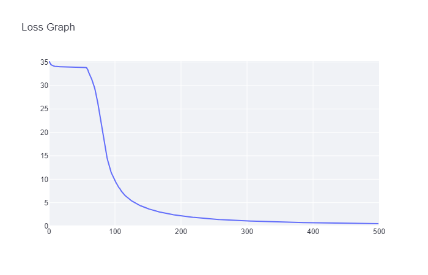

[](https://classroom.github.com/a/YFgwt0yY)

# MiniTorch Module 2


- Docs: https://minitorch.github.io/

- Overview: https://minitorch.github.io/module2/module2/

This assignment requires the following files from the previous assignments. You can get these by running

```bash
python sync_previous_module.py previous-module-dir current-module-dir
```

The files that will be synced are:

        minitorch/operators.py minitorch/module.py minitorch/autodiff.py minitorch/scalar.py minitorch/scalar_functions.py minitorch/module.py project/run_manual.py project/run_scalar.py project/datasets.py

### Simple:

#### Hyperparameters:

- Learning rate: 0.5
- Number of epochs: 500
- Size of hidden layer: 2

#### Time per epoch: 0.141s

#### Logs:

```
Epoch: 0/500, loss: 0, correct: 0
Epoch: 10/500, loss: 34.08047989283159, correct: 29
Epoch: 20/500, loss: 33.97983855363779, correct: 29
Epoch: 30/500, loss: 33.964277343235956, correct: 29
Epoch: 40/500, loss: 33.95511958516878, correct: 29
Epoch: 50/500, loss: 33.94260200369112, correct: 29
Epoch: 60/500, loss: 33.30567444140289, correct: 29
Epoch: 70/500, loss: 29.574015517323982, correct: 29
Epoch: 80/500, loss: 21.93662835389461, correct: 40
Epoch: 90/500, loss: 14.03204872904695, correct: 47
Epoch: 100/500, loss: 9.97104536427194, correct: 49
Epoch: 110/500, loss: 7.652929947294046, correct: 50
Epoch: 120/500, loss: 6.069313684369979, correct: 50
Epoch: 130/500, loss: 5.0613905823814385, correct: 50
Epoch: 140/500, loss: 4.330344976121727, correct: 50
Epoch: 150/500, loss: 3.7740722074468493, correct: 50
Epoch: 160/500, loss: 3.333679946261419, correct: 50
Epoch: 170/500, loss: 2.9753235422624402, correct: 50
Epoch: 180/500, loss: 2.677803666140006, correct: 50
Epoch: 190/500, loss: 2.4267717134153446, correct: 50
Epoch: 200/500, loss: 2.2127204414873303, correct: 50
Epoch: 210/500, loss: 2.028207979192048, correct: 50
Epoch: 220/500, loss: 1.8679984196272679, correct: 50
Epoch: 230/500, loss: 1.7277985658052437, correct: 50
Epoch: 240/500, loss: 1.6044222482952848, correct: 50
Epoch: 250/500, loss: 1.495228824507075, correct: 50
Epoch: 260/500, loss: 1.3981296433923354, correct: 50
Epoch: 270/500, loss: 1.3113178853159075, correct: 50
Epoch: 280/500, loss: 1.23654160468516, correct: 50
Epoch: 290/500, loss: 1.1679002267479033, correct: 50
Epoch: 300/500, loss: 1.1049081131276957, correct: 50
Epoch: 310/500, loss: 1.0494943781888686, correct: 50
Epoch: 320/500, loss: 0.9987321037590857, correct: 50
Epoch: 330/500, loss: 0.9520838718503914, correct: 50
Epoch: 340/500, loss: 0.9091010745882862, correct: 50
Epoch: 350/500, loss: 0.8694020256962041, correct: 50
Epoch: 360/500, loss: 0.8326327491400879, correct: 50
Epoch: 370/500, loss: 0.7985094153596356, correct: 50
Epoch: 380/500, loss: 0.766784670095494, correct: 50
Epoch: 390/500, loss: 0.7372232619302964, correct: 50
Epoch: 400/500, loss: 0.7096257812443727, correct: 50
Epoch: 410/500, loss: 0.6838235010623949, correct: 50
Epoch: 420/500, loss: 0.6596254049155421, correct: 50
Epoch: 430/500, loss: 0.6369296577919257, correct: 50
Epoch: 440/500, loss: 0.615595434555017, correct: 50
Epoch: 450/500, loss: 0.5955168957775472, correct: 50
Epoch: 460/500, loss: 0.5765711098111501, correct: 50
Epoch: 470/500, loss: 0.558694016334377, correct: 50
Epoch: 480/500, loss: 0.5417927750679408, correct: 50
Epoch: 490/500, loss: 0.525791192811307, correct: 50
Epoch: 500/500, loss: 0.5106279154029487, correct: 50
```

#### Plots:




### Diag:

#### Hyperparameters:

- Learning rate: 0.5
- Number of epochs: 500
- Size of hidden layer: 2

#### Time per epoch: 0.096s

#### Logs:

```
Epoch: 0/500, loss: 0, correct: 0
Epoch: 10/500, loss: 7.402856046438806, correct: 48
Epoch: 20/500, loss: 6.986897777785992, correct: 48
Epoch: 30/500, loss: 6.673004152991697, correct: 48
Epoch: 40/500, loss: 6.349873193410151, correct: 48
Epoch: 50/500, loss: 6.002795263444534, correct: 48
Epoch: 60/500, loss: 5.6258133064875215, correct: 48
Epoch: 70/500, loss: 5.219175607564605, correct: 48
Epoch: 80/500, loss: 4.7912482871534765, correct: 48
Epoch: 90/500, loss: 4.359143201608827, correct: 48
Epoch: 100/500, loss: 3.945932461163321, correct: 48
Epoch: 110/500, loss: 3.5722458158518675, correct: 48
Epoch: 120/500, loss: 3.2605047564336056, correct: 49
Epoch: 130/500, loss: 3.020460715815685, correct: 49
Epoch: 140/500, loss: 2.819011137817124, correct: 49
Epoch: 150/500, loss: 2.648474612407751, correct: 49
Epoch: 160/500, loss: 2.5027052882125806, correct: 49
Epoch: 170/500, loss: 2.3780881871814983, correct: 49
Epoch: 180/500, loss: 2.2751490127162843, correct: 49
Epoch: 190/500, loss: 2.181022240718921, correct: 49
Epoch: 200/500, loss: 2.097835474697921, correct: 49
Epoch: 210/500, loss: 2.0235501329675625, correct: 49
Epoch: 220/500, loss: 1.9566713823109705, correct: 49
Epoch: 230/500, loss: 1.8959867335672775, correct: 49
Epoch: 240/500, loss: 1.8405098730230574, correct: 49
Epoch: 250/500, loss: 1.7894634323233727, correct: 49
Epoch: 260/500, loss: 1.743390188129278, correct: 49
Epoch: 270/500, loss: 1.6993529849552056, correct: 49
Epoch: 280/500, loss: 1.6591091419004171, correct: 49
Epoch: 290/500, loss: 1.621324359951787, correct: 49
Epoch: 300/500, loss: 1.584486456260091, correct: 49
Epoch: 310/500, loss: 1.550200818317739, correct: 49
Epoch: 320/500, loss: 1.5186500409189838, correct: 49
Epoch: 330/500, loss: 1.489355754685275, correct: 49
Epoch: 340/500, loss: 1.4608703504253902, correct: 49
Epoch: 350/500, loss: 1.433142751714886, correct: 49
Epoch: 360/500, loss: 1.4060505973544821, correct: 49
Epoch: 370/500, loss: 1.3795230899182975, correct: 49
Epoch: 380/500, loss: 1.353505727469912, correct: 49
Epoch: 390/500, loss: 1.32795219362722, correct: 49
Epoch: 400/500, loss: 1.3028233334655954, correct: 49
Epoch: 410/500, loss: 1.2780862665564299, correct: 49
Epoch: 420/500, loss: 1.2537136153716397, correct: 49
Epoch: 430/500, loss: 1.2296907522239928, correct: 50
Epoch: 440/500, loss: 1.2060005874429724, correct: 50
Epoch: 450/500, loss: 1.182615405087986, correct: 50
Epoch: 460/500, loss: 1.159524000142696, correct: 50
Epoch: 470/500, loss: 1.1367264624673223, correct: 50
Epoch: 480/500, loss: 1.1142107974621451, correct: 50
Epoch: 490/500, loss: 1.091972889815313, correct: 50
Epoch: 500/500, loss: 1.0700074888661857, correct: 50
```

#### Plots:


### Split:

#### Hyperparameters:

- Learning rate: 0.1
- Number of epochs: 500
- Size of hidden layer: 8

#### Time per epoch: 0.690s

#### Logs:

```
Epoch: 0/500, loss: 0, correct: 0
Epoch: 10/500, loss: 32.65681139065093, correct: 32
Epoch: 20/500, loss: 30.660573935813076, correct: 35
Epoch: 30/500, loss: 29.76444160037632, correct: 39
Epoch: 40/500, loss: 29.01455594228726, correct: 39
Epoch: 50/500, loss: 28.3626887727733, correct: 39
Epoch: 60/500, loss: 27.724443444807555, correct: 39
Epoch: 70/500, loss: 27.029754343858347, correct: 40
Epoch: 80/500, loss: 26.08069629942736, correct: 41
Epoch: 90/500, loss: 25.029362486606487, correct: 42
Epoch: 100/500, loss: 23.993675715195522, correct: 43
Epoch: 110/500, loss: 23.306163138920592, correct: 43
Epoch: 120/500, loss: 22.65409468019789, correct: 43
Epoch: 130/500, loss: 22.02981934775976, correct: 43
Epoch: 140/500, loss: 21.422080424813558, correct: 43
Epoch: 150/500, loss: 20.83375575602017, correct: 43
Epoch: 160/500, loss: 20.254435361288976, correct: 43
Epoch: 170/500, loss: 19.670728055190374, correct: 43
Epoch: 180/500, loss: 19.106161600208793, correct: 43
Epoch: 190/500, loss: 18.540627267484084, correct: 43
Epoch: 200/500, loss: 17.976375168609415, correct: 43
Epoch: 210/500, loss: 17.415610129950064, correct: 43
Epoch: 220/500, loss: 16.85859053307833, correct: 43
Epoch: 230/500, loss: 16.3128262646246, correct: 43
Epoch: 240/500, loss: 15.771498024690771, correct: 43
Epoch: 250/500, loss: 15.23918036935163, correct: 43
Epoch: 260/500, loss: 14.706772243607439, correct: 43
Epoch: 270/500, loss: 14.185394155567723, correct: 43
Epoch: 280/500, loss: 13.674752859186944, correct: 43
Epoch: 290/500, loss: 13.172045622748154, correct: 43
Epoch: 300/500, loss: 12.676300159788493, correct: 43
Epoch: 310/500, loss: 12.199012944188775, correct: 43
Epoch: 320/500, loss: 11.740055023387324, correct: 44
Epoch: 330/500, loss: 11.300249897738775, correct: 45
Epoch: 340/500, loss: 10.881136819237868, correct: 46
Epoch: 350/500, loss: 10.479084208167206, correct: 46
Epoch: 360/500, loss: 10.094974465879712, correct: 47
Epoch: 370/500, loss: 9.729022506573125, correct: 47
Epoch: 380/500, loss: 9.38124024569567, correct: 47
Epoch: 390/500, loss: 9.046765678452688, correct: 50
Epoch: 400/500, loss: 8.729461083981034, correct: 50
Epoch: 410/500, loss: 8.4292296850216, correct: 50
Epoch: 420/500, loss: 8.144304924633605, correct: 50
Epoch: 430/500, loss: 7.876725770605299, correct: 50
Epoch: 440/500, loss: 7.617284526987465, correct: 50
Epoch: 450/500, loss: 7.375874605478695, correct: 50
Epoch: 460/500, loss: 7.1498143806707315, correct: 50
Epoch: 470/500, loss: 6.93235857652518, correct: 50
Epoch: 480/500, loss: 6.718759635801301, correct: 50
Epoch: 490/500, loss: 6.523841359235439, correct: 50
Epoch: 500/500, loss: 6.341883183080107, correct: 50
```

#### Plots:


### XOR:

#### Hyperparameters:

- Learning rate: 0.5
- Number of epochs: 450
- Size of hidden layer: 16

#### Time per epoch: 1.477s

#### Logs:

```
Epoch: 0/450, loss: 0, correct: 0
Epoch: 10/450, loss: 27.487113392116797, correct: 38
Epoch: 20/450, loss: 23.61863602168389, correct: 41
Epoch: 30/450, loss: 20.008054824381716, correct: 43
Epoch: 40/450, loss: 18.373005195366936, correct: 44
Epoch: 50/450, loss: 17.130007744276572, correct: 44
Epoch: 60/450, loss: 16.181082759538114, correct: 44
Epoch: 70/450, loss: 14.82121587170639, correct: 45
Epoch: 80/450, loss: 13.465060004913852, correct: 45
Epoch: 90/450, loss: 13.70916145723347, correct: 45
Epoch: 100/450, loss: 11.86703693628776, correct: 45
Epoch: 110/450, loss: 11.317333214100852, correct: 46
Epoch: 120/450, loss: 11.008131540796612, correct: 44
Epoch: 130/450, loss: 9.98417762724209, correct: 45
Epoch: 140/450, loss: 8.752946378517768, correct: 46
Epoch: 150/450, loss: 8.324504872507923, correct: 46
Epoch: 160/450, loss: 9.416683377298067, correct: 45
Epoch: 170/450, loss: 7.478931879575026, correct: 47
Epoch: 180/450, loss: 5.744875854750247, correct: 48
Epoch: 190/450, loss: 8.967522822798603, correct: 45
Epoch: 200/450, loss: 4.228614653111024, correct: 49
Epoch: 210/450, loss: 2.8371526264689226, correct: 50
Epoch: 220/450, loss: 2.6174211622063988, correct: 50
Epoch: 230/450, loss: 2.3884730740523037, correct: 50
Epoch: 240/450, loss: 2.1938901844104572, correct: 50
Epoch: 250/450, loss: 2.0808530556995897, correct: 50
Epoch: 260/450, loss: 2.1195275038084644, correct: 49
Epoch: 270/450, loss: 2.1799837939435682, correct: 49
Epoch: 280/450, loss: 2.6813347649019175, correct: 49
Epoch: 290/450, loss: 2.850638287878092, correct: 49
Epoch: 300/450, loss: 2.4288379441743704, correct: 49
Epoch: 310/450, loss: 2.038844073551116, correct: 49
Epoch: 320/450, loss: 1.858842382974927, correct: 49
Epoch: 330/450, loss: 1.7469729154948415, correct: 49
Epoch: 340/450, loss: 1.674176045920391, correct: 49
Epoch: 350/450, loss: 1.627751378530954, correct: 49
Epoch: 360/450, loss: 1.6148794426815027, correct: 49
Epoch: 370/450, loss: 1.6765145923864178, correct: 49
Epoch: 380/450, loss: 2.0596084112923108, correct: 49
Epoch: 390/450, loss: 2.388450704571683, correct: 49
Epoch: 400/450, loss: 2.228298294432427, correct: 49
Epoch: 410/450, loss: 1.9487236763298015, correct: 49
Epoch: 420/450, loss: 1.469717235741998, correct: 49
Epoch: 430/450, loss: 0.9020347984772178, correct: 50
Epoch: 440/450, loss: 0.8496534393416978, correct: 50
Epoch: 450/450, loss: 0.8179839264258219, correct: 50
```

#### Plots:


