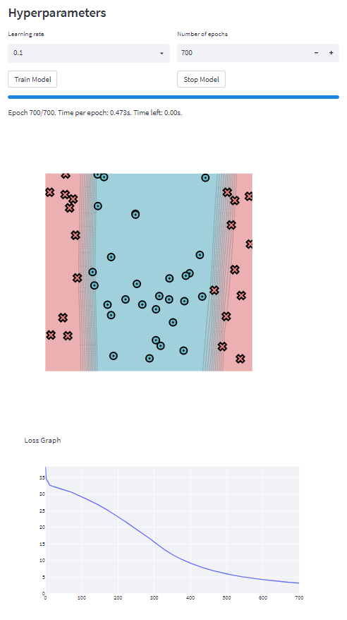

[](https://classroom.github.com/a/YFgwt0yY)

# MiniTorch Module 2


- Docs: https://minitorch.github.io/

- Overview: https://minitorch.github.io/module2/module2/

This assignment requires the following files from the previous assignments. You can get these by running

```bash
python sync_previous_module.py previous-module-dir current-module-dir
```

The files that will be synced are:

        minitorch/operators.py minitorch/module.py minitorch/autodiff.py minitorch/scalar.py minitorch/scalar_functions.py minitorch/module.py project/run_manual.py project/run_scalar.py project/datasets.py

### Simple:

#### Hyperparameters:

- Learning rate: 0.5
- Number of epochs: 500
- Size of hidden layer: 2

#### Logs:

```
Epoch: 0/500, loss: 0, correct: 0
Epoch: 10/500, loss: 34.07759702346554, correct: 31
Epoch: 20/500, loss: 29.213990715006183, correct: 38
Epoch: 30/500, loss: 21.72410433681779, correct: 45
Epoch: 40/500, loss: 14.259450599149446, correct: 48
Epoch: 50/500, loss: 9.355333958596026, correct: 47
Epoch: 60/500, loss: 10.623331647564626, correct: 50
Epoch: 70/500, loss: 6.364572558053164, correct: 49
Epoch: 80/500, loss: 6.2676794538016285, correct: 47
Epoch: 90/500, loss: 7.536980131789384, correct: 47
Epoch: 100/500, loss: 4.0637240677476125, correct: 49
Epoch: 110/500, loss: 4.070570614983694, correct: 48
Epoch: 120/500, loss: 33.21050515009908, correct: 36
Epoch: 130/500, loss: 3.1685447526044324, correct: 50
Epoch: 140/500, loss: 2.6016205167091, correct: 50
Epoch: 150/500, loss: 2.2602400332594628, correct: 50
Epoch: 160/500, loss: 2.0197329315837615, correct: 50
Epoch: 170/500, loss: 1.8698553875457076, correct: 50
Epoch: 180/500, loss: 4.987217394497048, correct: 47
Epoch: 190/500, loss: 45.08860569593021, correct: 37
Epoch: 200/500, loss: 2.1037007890034944, correct: 50
Epoch: 210/500, loss: 1.8123066093991762, correct: 50
Epoch: 220/500, loss: 1.6113436065239282, correct: 50
Epoch: 230/500, loss: 1.4572929518037956, correct: 50
Epoch: 240/500, loss: 1.3338769717261507, correct: 50
Epoch: 250/500, loss: 1.2315836571157641, correct: 50
Epoch: 260/500, loss: 1.144433389267888, correct: 50
Epoch: 270/500, loss: 1.0687470859212727, correct: 50
Epoch: 280/500, loss: 1.0021852632170973, correct: 50
Epoch: 290/500, loss: 0.9429847595481796, correct: 50
Epoch: 300/500, loss: 0.8898429818108518, correct: 50
Epoch: 310/500, loss: 0.841955760785119, correct: 50
Epoch: 320/500, loss: 0.8003118635256319, correct: 50
Epoch: 330/500, loss: 0.7897396399140534, correct: 50
Epoch: 340/500, loss: 2.143757938865615, correct: 49
Epoch: 350/500, loss: 19.93678543608651, correct: 46
Epoch: 360/500, loss: 0.9541284717906129, correct: 50
Epoch: 370/500, loss: 0.8162126021185898, correct: 50
Epoch: 380/500, loss: 0.7568298244150059, correct: 50
Epoch: 390/500, loss: 0.7165038367096478, correct: 50
Epoch: 400/500, loss: 0.681113677051323, correct: 50
Epoch: 410/500, loss: 0.648323040435436, correct: 50
Epoch: 420/500, loss: 0.6180164606100798, correct: 50
Epoch: 430/500, loss: 0.5899696997386714, correct: 50
Epoch: 440/500, loss: 0.5639737520231339, correct: 50
Epoch: 450/500, loss: 0.5398396725134172, correct: 50
Epoch: 460/500, loss: 0.5173933240631604, correct: 50
Epoch: 470/500, loss: 0.49647468829345764, correct: 50
Epoch: 480/500, loss: 0.4766255835301506, correct: 50
Epoch: 490/500, loss: 0.4587128109276982, correct: 50
Epoch: 500/500, loss: 0.44189558429595965, correct: 50
```

#### Plots:


### Diag:

#### Hyperparameters:

- Learning rate: 0.5
- Number of epochs: 500
- Size of hidden layer: 2

#### Logs:

```
Epoch: 0/500, loss: 0, correct: 0
Epoch: 10/500, loss: 7.402856046438806, correct: 48
Epoch: 20/500, loss: 6.986897777785992, correct: 48
Epoch: 30/500, loss: 6.673004152991697, correct: 48
Epoch: 40/500, loss: 6.349873193410151, correct: 48
Epoch: 50/500, loss: 6.002795263444534, correct: 48
Epoch: 60/500, loss: 5.6258133064875215, correct: 48
Epoch: 70/500, loss: 5.219175607564605, correct: 48
Epoch: 80/500, loss: 4.7912482871534765, correct: 48
Epoch: 90/500, loss: 4.359143201608827, correct: 48
Epoch: 100/500, loss: 3.945932461163321, correct: 48
Epoch: 110/500, loss: 3.5722458158518675, correct: 48
Epoch: 120/500, loss: 3.2605047564336056, correct: 49
Epoch: 130/500, loss: 3.020460715815685, correct: 49
Epoch: 140/500, loss: 2.819011137817124, correct: 49
Epoch: 150/500, loss: 2.648474612407751, correct: 49
Epoch: 160/500, loss: 2.5027052882125806, correct: 49
Epoch: 170/500, loss: 2.3780881871814983, correct: 49
Epoch: 180/500, loss: 2.2751490127162843, correct: 49
Epoch: 190/500, loss: 2.181022240718921, correct: 49
Epoch: 200/500, loss: 2.097835474697921, correct: 49
Epoch: 210/500, loss: 2.0235501329675625, correct: 49
Epoch: 220/500, loss: 1.9566713823109705, correct: 49
Epoch: 230/500, loss: 1.8959867335672775, correct: 49
Epoch: 240/500, loss: 1.8405098730230574, correct: 49
Epoch: 250/500, loss: 1.7894634323233727, correct: 49
Epoch: 260/500, loss: 1.743390188129278, correct: 49
Epoch: 270/500, loss: 1.6993529849552056, correct: 49
Epoch: 280/500, loss: 1.6591091419004171, correct: 49
Epoch: 290/500, loss: 1.621324359951787, correct: 49
Epoch: 300/500, loss: 1.584486456260091, correct: 49
Epoch: 310/500, loss: 1.550200818317739, correct: 49
Epoch: 320/500, loss: 1.5186500409189838, correct: 49
Epoch: 330/500, loss: 1.489355754685275, correct: 49
Epoch: 340/500, loss: 1.4608703504253902, correct: 49
Epoch: 350/500, loss: 1.433142751714886, correct: 49
Epoch: 360/500, loss: 1.4060505973544821, correct: 49
Epoch: 370/500, loss: 1.3795230899182975, correct: 49
Epoch: 380/500, loss: 1.353505727469912, correct: 49
Epoch: 390/500, loss: 1.32795219362722, correct: 49
Epoch: 400/500, loss: 1.3028233334655954, correct: 49
Epoch: 410/500, loss: 1.2780862665564299, correct: 49
Epoch: 420/500, loss: 1.2537136153716397, correct: 49
Epoch: 430/500, loss: 1.2296907522239928, correct: 50
Epoch: 440/500, loss: 1.2060005874429724, correct: 50
Epoch: 450/500, loss: 1.182615405087986, correct: 50
Epoch: 460/500, loss: 1.159524000142696, correct: 50
Epoch: 470/500, loss: 1.1367264624673223, correct: 50
Epoch: 480/500, loss: 1.1142107974621451, correct: 50
Epoch: 490/500, loss: 1.091972889815313, correct: 50
Epoch: 500/500, loss: 1.0700074888661857, correct: 50
```

#### Plots:


### Split:

#### Hyperparameters:

- Learning rate: 0.5
- Number of epochs: 300
- Size of hidden layer: 8

#### Logs:

```
Epoch: 0/300, loss: 0, correct: 0
Epoch: 10/300, loss: 29.359173637040957, correct: 35
Epoch: 20/300, loss: 27.8527866309571, correct: 35
Epoch: 30/300, loss: 30.380726953558664, correct: 31
Epoch: 40/300, loss: 28.98643454913285, correct: 31
Epoch: 50/300, loss: 27.072014299344904, correct: 35
Epoch: 60/300, loss: 26.34485331189513, correct: 36
Epoch: 70/300, loss: 25.994689137005988, correct: 36
Epoch: 80/300, loss: 23.943555701186924, correct: 37
Epoch: 90/300, loss: 20.972469515445496, correct: 38
Epoch: 100/300, loss: 19.798323146562225, correct: 39
Epoch: 110/300, loss: 17.536245113914994, correct: 40
Epoch: 120/300, loss: 15.508182428624234, correct: 43
Epoch: 130/300, loss: 13.671779519842868, correct: 45
Epoch: 140/300, loss: 13.038449960011626, correct: 45
Epoch: 150/300, loss: 11.004523917992179, correct: 45
Epoch: 160/300, loss: 10.421208106123858, correct: 45
Epoch: 170/300, loss: 6.915372680674845, correct: 48
Epoch: 180/300, loss: 5.96357342785572, correct: 48
Epoch: 190/300, loss: 5.261896326093942, correct: 48
Epoch: 200/300, loss: 7.181401347577988, correct: 47
Epoch: 210/300, loss: 5.628416339583532, correct: 48
Epoch: 220/300, loss: 7.051113624863076, correct: 47
Epoch: 230/300, loss: 3.829099545741122, correct: 49
Epoch: 240/300, loss: 5.754346563054557, correct: 48
Epoch: 250/300, loss: 2.5187704858967246, correct: 50
Epoch: 260/300, loss: 2.5789128391095475, correct: 50
Epoch: 270/300, loss: 15.008697558552734, correct: 45
Epoch: 280/300, loss: 2.170444613479042, correct: 50
Epoch: 290/300, loss: 1.8024524247525675, correct: 50
Epoch: 300/300, loss: 1.640017610900474, correct: 50
```

#### Plots:



### XOR:

#### Hyperparameters:

- Learning rate: 0.5
- Number of epochs: 450
- Size of hidden layer: 16

#### Logs:

```
Epoch: 0/450, loss: 0, correct: 0
Epoch: 10/450, loss: 27.487113392116797, correct: 38
Epoch: 20/450, loss: 23.61863602168389, correct: 41
Epoch: 30/450, loss: 20.008054824381716, correct: 43
Epoch: 40/450, loss: 18.373005195366936, correct: 44
Epoch: 50/450, loss: 17.130007744276572, correct: 44
Epoch: 60/450, loss: 16.181082759538114, correct: 44
Epoch: 70/450, loss: 14.82121587170639, correct: 45
Epoch: 80/450, loss: 13.465060004913852, correct: 45
Epoch: 90/450, loss: 13.70916145723347, correct: 45
Epoch: 100/450, loss: 11.86703693628776, correct: 45
Epoch: 110/450, loss: 11.317333214100852, correct: 46
Epoch: 120/450, loss: 11.008131540796612, correct: 44
Epoch: 130/450, loss: 9.98417762724209, correct: 45
Epoch: 140/450, loss: 8.752946378517768, correct: 46
Epoch: 150/450, loss: 8.324504872507923, correct: 46
Epoch: 160/450, loss: 9.416683377298067, correct: 45
Epoch: 170/450, loss: 7.478931879575026, correct: 47
Epoch: 180/450, loss: 5.744875854750247, correct: 48
Epoch: 190/450, loss: 8.967522822798603, correct: 45
Epoch: 200/450, loss: 4.228614653111024, correct: 49
Epoch: 210/450, loss: 2.8371526264689226, correct: 50
Epoch: 220/450, loss: 2.6174211622063988, correct: 50
Epoch: 230/450, loss: 2.3884730740523037, correct: 50
Epoch: 240/450, loss: 2.1938901844104572, correct: 50
Epoch: 250/450, loss: 2.0808530556995897, correct: 50
Epoch: 260/450, loss: 2.1195275038084644, correct: 49
Epoch: 270/450, loss: 2.1799837939435682, correct: 49
Epoch: 280/450, loss: 2.6813347649019175, correct: 49
Epoch: 290/450, loss: 2.850638287878092, correct: 49
Epoch: 300/450, loss: 2.4288379441743704, correct: 49
Epoch: 310/450, loss: 2.038844073551116, correct: 49
Epoch: 320/450, loss: 1.858842382974927, correct: 49
Epoch: 330/450, loss: 1.7469729154948415, correct: 49
Epoch: 340/450, loss: 1.674176045920391, correct: 49
Epoch: 350/450, loss: 1.627751378530954, correct: 49
Epoch: 360/450, loss: 1.6148794426815027, correct: 49
Epoch: 370/450, loss: 1.6765145923864178, correct: 49
Epoch: 380/450, loss: 2.0596084112923108, correct: 49
Epoch: 390/450, loss: 2.388450704571683, correct: 49
Epoch: 400/450, loss: 2.228298294432427, correct: 49
Epoch: 410/450, loss: 1.9487236763298015, correct: 49
Epoch: 420/450, loss: 1.469717235741998, correct: 49
Epoch: 430/450, loss: 0.9020347984772178, correct: 50
Epoch: 440/450, loss: 0.8496534393416978, correct: 50
Epoch: 450/450, loss: 0.8179839264258219, correct: 50
```

#### Plots:


